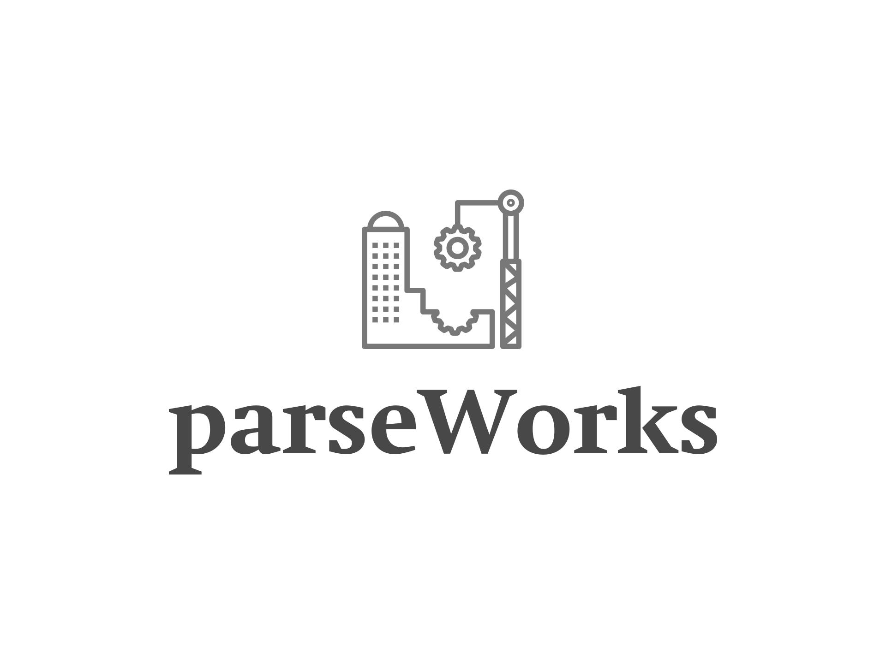

# parseWorks


**parseWorks** is a Java parser combinator framework for constructing [LLR(*) parsers](http://en.wikipedia.org/wiki/LL_parser). This library draws inspiration from Jon Hanson's [ParsecJ](https://github.com/jon-hanson/parsecj) and [FuncJ](https://github.com/typemeta/funcj) libraries.

The design philosophy of `parseWorks` is to provide a lightweight, composable, and expressive way to build parsers directly in Java, using a style that aligns with Java naming conventions and idioms rather than academic parser terminology.

## Key Features

- **Composable Parser Combinators**: Offers a DSL for constructing parsers.
- **Informative Error Messages**: Pinpoints parse failures effectively.
- **Thread-Safe**: Uses immutable parsers and inputs.
- **Lightweight**: Zero dependencies, except for JUnit in tests.
- **Left-Recursion Failsafe**: Prevents common pitfalls.
- **Looping Empty Input Detection**: Detects infinite loops on empty inputs.

## Documentation

For detailed information about parseWorks, please refer to:

- [User Guide](docs/user-guide.md) - A comprehensive guide for getting started with parseWorks
- [Advanced User Guide](docs/advanced-user-guide.md) - In-depth information for advanced users
- [Parser Design Guide](docs/parser-design-guide.md) - A systematic approach to designing and implementing parsers

## Getting Started

### Requirements

parseWorks requires **Java 17** or higher.

### Installation

Add the following dependency to your Maven `pom.xml`:

```xml
<dependency>
   <groupId>io.github.parseworks</groupId>
   <artifactId>parseworks</artifactId>
   <version>2.2.0</version>
</dependency>
```

## Overview

parseWorks is a parser combinator library that allows you to build parsers directly in Java. Unlike traditional parser generators like Yacc or ANTLR that require separate grammar files and code generation, parser combinators let you express your grammar rules directly in your code.

### Core Concepts

parseWorks is built around three main types:

- **Parser<I, A>**: The core interface for parsers that transform input of type `I` into a value of type `A`
- **Input<I>**: Represents a position in a stream of tokens
- **Result<I, A>**: Encapsulates the outcome of parsing (success or failure)

## Quick Example

Here's a simple example of parsing an arithmetic expression:

```java
// Define a parser for a simple addition expression
Parser<Character, Integer> sum = 
    number.thenSkip(chr('+')).then(number).map(Integer::sum);

// Parse the input "1+2"
int result = sum.parse(Input.of("1+2")).get();
assert result == 3;

// Handle parsing errors
sum.parse(Input.of("1+z")).handle(
    success -> "Success: " + success,
    failure -> "Error: " + failure.fullErrorMessage()
);
// Output: "Error: Failure at position 2, saw 'z', expected <number>"
```

## More Examples

For more examples and detailed explanations, please refer to the [User Guide](docs/user-guide.md).

The [Advanced User Guide](docs/advanced-user-guide.md) covers topics such as:

- Advanced parser combinators
- Error handling strategies
- Performance optimization
- Working with complex grammars
- Integration patterns
- Troubleshooting

## License

parseWorks is available under the [MIT License](LICENSE).
